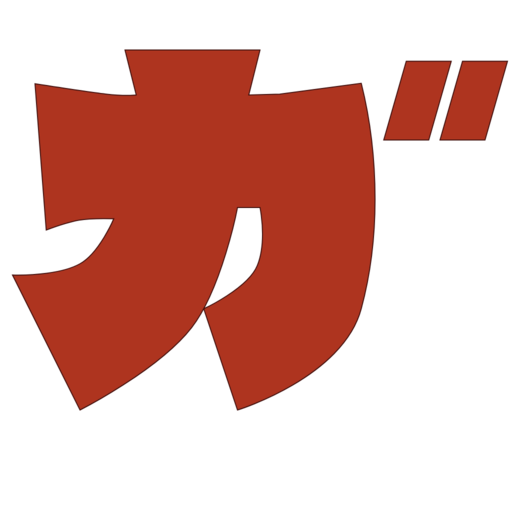

garoon-sync
====


Garoon-Sync is a macOS / Windows GUI Application to sync your Cybozu Garoon schedule to Google Calendar.

## Feature
- Sync Garoon schedules to Google Calendar.
  - Support for normal, repeat temprarary and banner schedules.

## Screenshot
### Tutorial
### Menu icon

## Todo
- [ ] Sync deleted schedules.
- [ ] Optimize for update request of Google Calendar API to send only difference.
- [ ] Config window (customize sync interval)
- [ ] Remind by System notification
- [ ] Auto Update
- [ ] Crash reporter

## Build
```console
$ npm install --global-style

# for native node modules. see https://electron.atom.io/docs/tutorial/using-native-node-modules
$ ./node_modules/.bin/electron-rebuild
# If error occurred such as `no <openssl/rsa.h>` on macOS (For Homebrew user):
$ brew install openssl
$ LDFLAGS=-L/usr/local/opt/openssl/lib CPPFLAGS=-I/usr/local/opt/openssl/include ./node_modules/.bin/electron-rebuild

# see how to generate client id and secret: https://developers.google.com/google-apps/calendar/quickstart/nodejs
$ GOOGLE_CLIENT_ID=XXXX GOOGLE_CLIENT_SECRET=YYYY npm run build

# (optional) If default garoon server exists for your app: (GAROON_EVENT_PAGE_URL must not have query string.)
$ GAROON_URL=http://example.com/ GAROON_EVENT_PAGE_URL=http://example.com/grn/schedule/view.csp \
GOOGLE_CLIENT_ID=XXXX GOOGLE_CLIENT_SECRET=YYYY npm run build
```

## Project structure
All TypeScript files (`*.ts`, `*.tsx`) are compiled by using webpack.

```
src
├── app
│   └── js
│       ├── main
│       │   └── index.ts
│       └── renderer
│           ├── app.tsx
│           ├── components
│           ├── containers
│           ├── modules
│           └── tutorial.tsx
└── tutorial.html
```

- `src/app/js`
  - All JavaScript/TypeScript files are saved in.
- `src/app/js/main`
  - Scripts for Electron's main process.
  - All scripts are bundled to a file by webpack.

## License
This software is released under the MIT License, see LICENSE.
